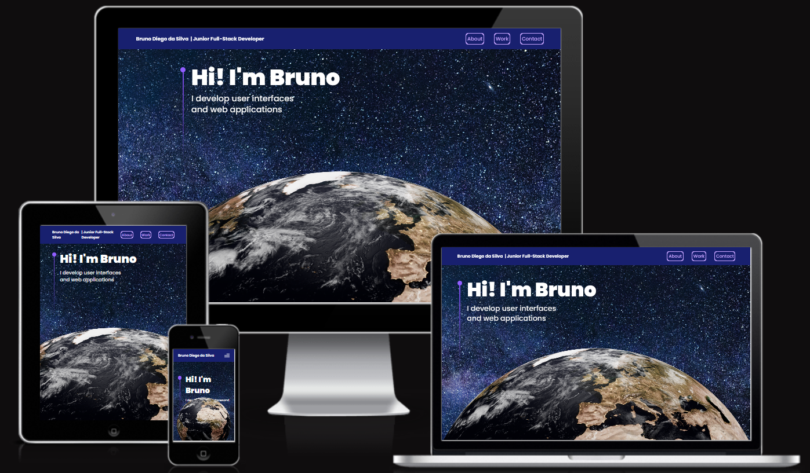

Welcome fellow visitor!

Feel free to access the [live website](https://bruno-diego.github.io/brunodiegodev/) (CTRL + Click to open in a new tab).

This is my 3D Portfolio. The last update to this repo was: **April 05, 2023**

## Introduction

I am excited to introduce myself and my portfolio as a Junior Full-Stack Developer. With a passion for software development and technology, I have spent countless hours exploring the intricacies of coding, debugging, and programming languages. Over time, I have transformed this passion into a profession and have become proficient in various programming languages, including JavaScript, Python, and PostgreSQL.

The most impressive websites in the world use 3D graphics and animations to bring their content to life like this one. 

I am thrilled to present my 3D Portfolio, featuring stunning 3D graphics and animations. This website was developed using ThreeJS, React Three Fiber, TailwindCSS, and Framer Motion, along with custom-designed 3D models and geometries. The code is reusable and scalable, following industry-standard best practices, and is responsive across all devices. Additionally, I have implemented a form that enables sending emails through the website.

As mentioned, on this website, I've used the following technologies:
- ThreeJS - a powerful 3D graphics library for rendering and animating the 3D model
- React Three Fiber - a popular library for creating 3D graphics with ThreeJS in React
- TailwindCSS - a popular utility-first CSS styling framework
- Framer Motion - the most popular library used to bring a React website to life with animations
- 

I've also used:
- Customized stunning 3D models and geometries with various lights, as well as the 3D world experience with a camera and positioning of an object in space.
- Made the code reusable and scalable using Higher Order Components (HOCs) and other industry-standard best practices
- Implemented sending emails through a form on the website
- Ensure responsiveness across all devices and improve your site's performance using Suspense and Preload.

The development of this website was greatly inspired by [Javascript Matery](https://www.youtube.com/@javascriptmastery) Youtube Channel to whom I send a huge thanks, specially for [THIS](https://www.youtube.com/watch?v=0fYi8SGA20k&t=3490s) tutorial.

---

I am always eager to take on new challenges and work on cutting-edge projects, and I look forward to continuing my journey in the world of software development and technology. 

Thank you for visiting my portfolio, and I hope you enjoy exploring it as much as I enjoyed creating it.

---